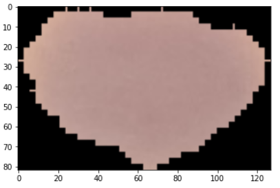
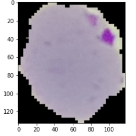
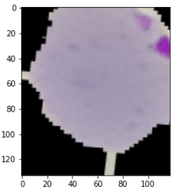

# Malaria Detect

## Inspiration 💡
I wanted to dive deeper into image processing and learn to work with CNNs. The prosepect of using Deep learning on blood cell images was inriguing and pushed me to take on this project. 
Malaria needs no introduction, a disease transmitted by the bite of infected diseases that affects the red blood cells in our bodies. Although now rare in the U.S., it can be hard to identify malaria, which is why lab tests/imaging are always needed. This project aims to be a tool in that process to help more accuratly and quickly diagnose the illness. 

## What it does ⚙️
Malaria Detect is intended as a tool in the hospital alongside the clinician. It accepts an image of a red blood cell, applies a binary classification deep learning model to determine if the sample is infected with malaria.

Healthy Blood Cell |  Infected Blood Cell
:-------------------------:|:-------------------------:
  |  

## How I built it 🛠️

### The Web App
This web app runs on a __Flask__ API server, complemented by an intuitive __React__ frontend, with user authentication handled by __Firebase__. Once the user selects and confirms that their sample, the image is sent to the backend via HTTP requests. There, it is preprocessed to fit the model's expected input dimensions. Then, the previously trained __TensorFlow__ model is loaded and fed the preprocessed image. Once the model has made its prediction, it's sent to the frontend and displayed.

### The Deep Learning Model
The model correctly classifies blood cells with an __accuracy__ of __87%__. First, I performed exploratory data analysis to get an idea of what the images look like, their average size and other potentially relevant metrics. The high accuracy was partially thanks to artificially expanding the dataset to generate more training data. Blood cell data isn't exactly very popular - it can be hard to come by. Learning how to augment a given data set, in this case, using rotations, shifts, reflections, zoom and shears, enabled me to account for transformed versions of images that were otherwise absent in the training set. In the Sequential model, I added dropout layers to reduce overfitting, and an early stopping callback to minimize validation loss. Lastly, once the model was trained on batches of images, it was saved for later use in the Flask server, and a classification report was generated for evaluation.

Infected Cell (Before Transformation) |  Infected (After Transformation)
:-------------------------:|:-------------------------:
  |  

Notice the zoom, shear (cuts) and slight rotation in the transformed image.

Note: Click [here](https://colab.research.google.com/drive/1ZZgkpYXL33pKm4fZ-7tjoWiXDO9o_jUY?usp=sharing) to walk through my process of building the model more interactively in a Colab notebook. 

The following were used in this project:
 - TensorFlow
 - Scikit-Learn
 - Pandas 
 - Matplotlib
 - Numpy
 - Flask
 - Firebase
 - React

## Challenges and Learnings 🧠
The biggest learnings from this project came from its challenges - working with image data. Having only worked with text and numerical data, I had to learn how to incorporate file previews, sending and parsing files in Python. Developing and deploying the model was quite the learning experience as well, preprocessing batches of images, performing transformations on the dataset, modifying network topology were all new to me. 

## Next Steps 🚀
I'd like to host the model on Google's AI Platform, from where Cloud Functions can be used to preprocess and pass images to the model whenever they are uploaded to Cloud Firestore. Then, these predictions will be available at an API endpoint that React can pull the predictions from. In a nutshell, I'd like to leverage the power of the Cloud to turn this into a serverless application to improve scalability. 
